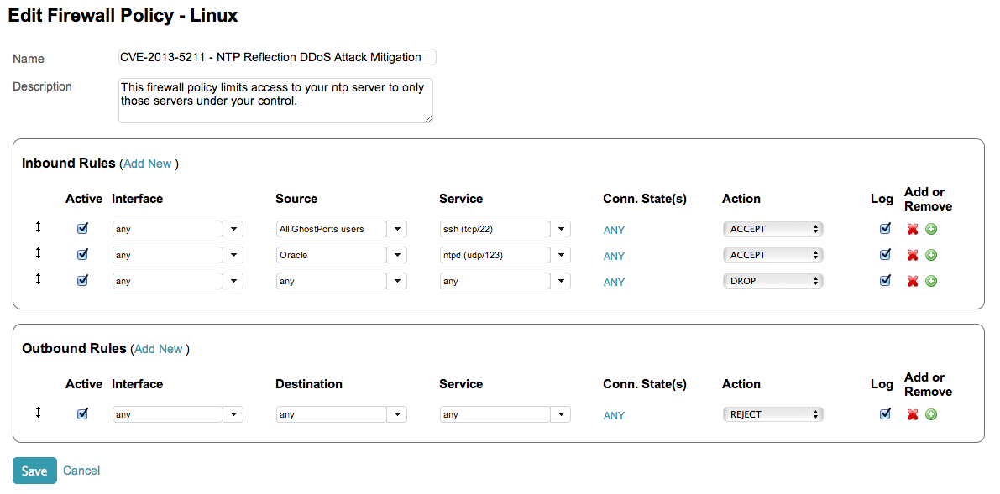
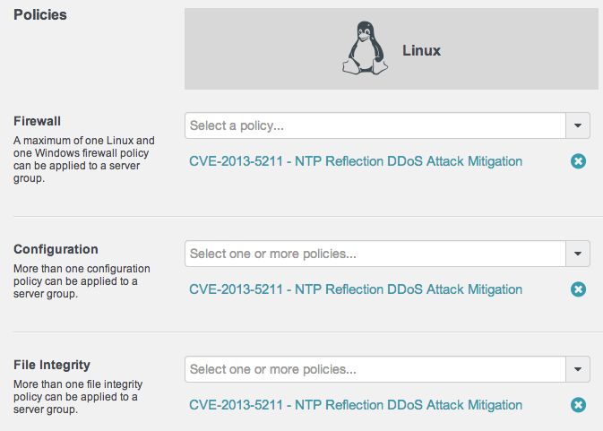

##CloudPassage Halo Policy: CVE-2013-5211 - NTP Reflection DDoS Attack Mitigation

###About
As reported by <a href="http://thehackernews.com/2014/01/Network-Time-Protocol-Reflection-DDoS-Attack-Tool.html" target="new">The Hacker News</a> researchers at <a href="http://www.symantec.com" target="new">Symantec</a> have "spotted Network Time Protocol (NTP) reflection DDoS attacks being launched by cyber criminals during the Holidays."

<blockquote>
From the Symantec post:

In this case, the attackers are taking advantage of the <code>monlist</code> command. Monlist is a remote command in older version of NTP that sends the requester a list of the last 600 hosts who have connected to that server. For attackers the monlist query is a great reconnaissance tool. For a localized NTP server it can help to build a network profile. However, as a DDoS tool, it is even better because a small query can redirect megabytes worth of traffic:

<code>
[root@server ~]# ntpdc -c monlist [hostname]

remote address port local address      count m ver code avgint  lstint 
================================================================ 
localhost.localdomain  53949 127.0.0.1              1 7 2      0      0       0 
tock.usshc.com            123 xxx.xxx.xxx.xxx         1 4 4    5d0      0      53 
198.52.198.248           123 xxx.xxx.xxx.xxx         1 4 4    5d0      0      54 
rook.slash31.com          123 xxx.xxx.xxx.xxx       1 4 4    5d0      0      55 
eightyeight.xmission.c   123 xxx.xxx.xxx.xxx         1 4 4    5d0      0      56
</code>

Most scanning tools, such as NMAP, have a monlist module for gathering network information and many attack tools, including metasploit, have a monlist DDoS module.

How can you protect your servers?  The easiest way to update to NTP version 4.2.7, which removes the <code>monlist</code> command entirely. If upgrading is not an option, you can start the NTP daemon with <code>noquery</code> enabled in the NTP conf file. This will disable access to mode 6 and 7 query packets (which includes <code>monlist</code>). 
</blockquote>

As tools already exist to take advantage of this attack vector, the exploitation of the ntp server becomes a trivial exercise.

The CVE entry details state that the monlist feature in ntp_request.c in ntpd in NTP before 4.2.7p26 allows remote attackers to cause a denial of service (traffic amplification) via forged (1) REQ_MON_GETLIST or (2) REQ_MON_GETLIST_1 requests, as exploited in the wild in December 2013. More information on the CVE can be found at <a href="http://web.nvd.nist.gov/view/vuln/detail?vulnId=CVE-2013-5211" target="new">http://web.nvd.nist.gov/view/vuln/detail?vulnId=CVE-2013-5211</a>.

The official bug issue can be viewed at <a href="http://bugs.ntp.org/show_bug.cgi?id=1532" target="new">http://bugs.ntp.org/show_bug.cgi?id=1532</a> and the full list of ntp access restriction configuration options can be found at <a href="http://support.ntp.org/bin/view/Support/AccessRestrictions" target="new">http://support.ntp.org/bin/view/Support/AccessRestrictions</a>.

####Affected versions
* NTP before 4.2.7p26

###CloudPassage Policy

To help users detect if their ntp servers are suceptible to DDoS attacks using the attack vector in CVE-2013-5211, a collection of CloudPassage Halo policies have been created.

###Rules and Checks
It should be noted that the following rules and checks could serve as a potential indicator of compromise (IOC). That being said, an alert on a true possitive on an individual check will likely not serve as the sole indicator of vulnerability, but it should still be investigated.

#### Configuration Security Monitoring
The <i>CVE-2013-5211 - NTP Reflection DDoS Attack Mitigation Configuration Security Monitoring (CSM)</i> policy validates that:

* <code>ntpd</code> process is running, is listening on <code>eth0</code>, and is owned by the <code>root</code> user and group,
* <code>/etc/ntp.conf</code> exists, has 644 file permissions, and is owned by the <code>root</code> user and group, and
* <code>/etc/ntp.conf</code> contains the mitigating <code>noquery</code> configuration setting.

#### File Integrity Monitoring
The <i>CVE-2013-5211 - NTP Reflection DDoS Attack Mitigation File Integrity Monitoring (CSM)</i> policy monitors <code>/etc/ntp.conf</code>, and alerts on any changes to the file or its metadata.

#### Dynamic Firewalls
Though you cannot directly import a Halo firewall policy at this time, you can easily create a new firewall policy to:

* Force remote administrative access (e.g. tcp/22) to be protected using GhostPorts,
* Restrict ntp server connections to servers also protected by Halo, and
* Deny all outbound access initiated from the ntp server to the Internet.

An example of what this might look like can be seen below.

<i>Note: If the ntp server has additional roles, your firewall policy will likely require further configuration enhancements as required by your environment.</i>

###Installation

To begin using the Halo policies configuration policy, download the CVE-2013-5211 - NTP Reflection DDoS Attack Mitigation CSM policy and FIM policy files to your local workstation, log into your CloudPassage Halo Portal account, and import the policies.

####To import a file integrity policy:
1. Go to <b>Policies > File Integrity Policies</b>. 
2. Above the list of policies, click <b>Import File Integrity Policy</b>. 
3. On the Import page, browse to select a file integrity policy file (extension = .fim.json), and then click <b>Import</b>. 
4. The imported policy appears in the list of policies on the File Integrity Policies page.

####To import a configuration policy:
1. Navigate to <b>Policies > Configuration Policies</b>, and click <b>Import Configuration Policy</b> 
2. Browse to select the .policy file to import. 
3. Click <b>Import</b>. The imported policy appears in the list of policies on the Configuration Policies page. 

Once imported, the policies should be applied to the group where your ntp servers reside. An example of this can be seen below.

###Contact

To provide any feedback or ask any questions please reach out to Andrew Hay on Twitter at <a href="http://twitter.com/andrewsmhay" target="new">@andrewsmhay</a>.
